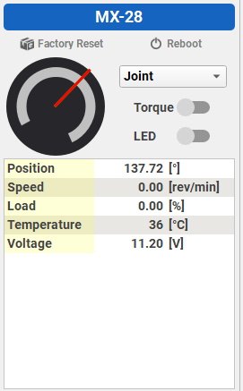

# Poppy Social Robotics SDK Legs
___
#### Team Members: Nathan Borrego, Miranda Goelz, Aleksander Thompson, James Gray, Helen Guerrero 
This is a continuation of the Poppy Social Robotics SDK by Colin Henson, Sydney Awid and Hannah Stent. This version contains functionality for legs. To see documentation concerning the head and face tracking please visit this [link](https://github.com/chenson399/poppy-sdk).
<br/>

While this project used the Poppy Social Robotics SDK code, this documentation will focus on the changes and updates made for the legs portion of the SDK.

## Project Overview
The purpose of this project was to modify the Poppy Social Robotics SDK to include functionality for a set of legs to work alongside the face tracking and gesturing of the upper torso completed by the Poppy Social Robotics SDK. Like the project before it, this project is based on the Poppy Project's Poppy robot. This project has made substitutions and changes to the materials and designs used in the original Poppy project. This project has been made for the University of Colorado at Colorado Springs.

## User Guide
This section will outline what tools were used and how they were used to work on this project. This is intended to help anyone who intends to use this code or will be working on Poppy in the future. 
### 0. Getting Started
To start, you will need the following software:<br/>

+ [Dynamixel Wizard 2.0](https://emanual.robotis.com/docs/en/software/dynamixel/dynamixel_wizard2/)

+ A Python 3 capable IDE 
  + PyCharm was used for this project.

This software allows the user to scan and configure Dynamixel Motors from Robotis.

You will also need the following hardware (which should still be with Poppy...).

+ [Dynamixel MX28T](https://www.robotis.us/dynamixel-mx-28t/)

+ [Dynamixel MX28AT](https://www.robotis.us/dynamixel-mx-28at/)

+ [Dynamixel MX64T](https://www.robotis.us/dynamixel-mx-64t/)

+ [Dynamixel MX64AT](https://www.robotis.us/dynamixel-mx-64at/)

+ [Robotis U2D2](https://www.robotis.us/u2d2/)

+ [12V 5A 60W Power Supply](https://www.robotis.us/smps-12v-5a-ps-10-us-110v/)

+ [U2D2 Power Hub Board Set](https://www.robotis.us/u2d2-power-hub-board-set/) or [SMPS2Dynamixel](https://www.robotis.us/smps2dynamixel/)

+ [TTL Cables](https://www.robotis.us/robot-cable-xl320-convertible-130mm-10pcs/) 

+ [TTL Cables Convertible](https://www.robotis.us/robot-cable-x3p-180mm-convertible-10pcs/) 
  + Please note that the U2D2 and Power Hub have white connectors while the servos have beige connectors. Beige TTL connectors ***will not*** fit white TTL connectors. You will need beige TTL to white TTL cables for these instances.

+ [TTL Hubs](https://www.robotis.us/3p-extension-pcb/)

+ And of course, you should have Poppy itself.

All this hardware is what was used during this project.

### 1. Using Dynamixel Wizard
The Dynamixel Wizard allows you to scan for servos on a USB COM port. To start, make sure you have the [Robotis U2D2](https://www.robotis.us/u2d2/) connected to your computer via USB. From here, connect a TTL cable from the U2D2 to a servo. Also, connect the power brick to the [U2D2 Power Hub Board Set](https://www.robotis.us/u2d2-power-hub-board-set/) and connect the U2D2 Power Hub Board Set TTL to the servo as well. With the U2D2 and the Power Hub both connected by TTL to the servo, you will be able to scan the servo on the Wizard.

First, click scan on the Wizard. The Wizard will scan all servo IDs and all baud rates to start with. You can change what IDs and baud rates to scan under Options > Scan. If you have a servo connected, once the scan is complete, you will see the servo and its ID show up on the left on the Wizard. You can click on the servo to see all the information and options for that servo. It is important to remember that each servo has an ID and a baud rate.

It is important to note that servos with the *same* ID **cannot** be displayed in the Wizard at the same time. All servo IDs **must** be unique to be scan-able and usable. **If you are integrating new servos into the system, you *MUST* scan in each new servo individually into the Wizard and change its ID to a new and unique ID before trying to use these servos together with existing or other new servos. All servos start with an ID of 1, so set it to something else and do not set it to an existing ID. A list of all used IDs for this project can be found below. Note that this can be tedious to do, and you may have to set temporary IDs on a servo in order to get it to what you want especially when swapping the IDs of servos.**
<br/><br/>
#### 1.1 Important Notes about Dynamixel Wizard and Servos
It is important to understand how the Dynamixel Wizard controls the servos so here are a few notes to be aware of. 

+ The servos in the Wizard operate on a 0&deg; to 360&deg; system. 

+ The middle and right pane of Dynamixel Wizard are interactable and allow you to change some values if you so desire. This can be unclear when first starting to use the Wizard. When interacting with a servo in joint mode, the red line is the goal position of the servo, while the green line is the actual position of the servo. The backing grey "circle" is the allowed limits on the angles of the servo. These angle limits can be changed, you will see them listed in the middle pane of the Wizard. It may prove useful to set angle limits so that you can more readily see where the servo can be, but be warned that they can also be misleading based to how the actual physical system works.

+ The servos ***will not*** cross the 360&deg; -> 0&deg; boundary and vice versus. This means that a servo trying to go from a postion of 26&deg; to 354&deg; ***will not*** take the short path by crossing 0&deg;. This can cause erratic behavior in the physical system if you are not careful with the initial positioning of servos when the system is built. It is important to make sure that the servos will never cross this boundary on their desired swinging path.

+ When the torque on a joint servo is **on**, the servo is locked and cannot free swing. Click the torque **off** will alow the servo to freely swing. This can be controlled by code which will be covered.

### 2. Controlling Servos with Python
This project uses the [pypot.dynamixel library](https://github.com/poppy-project/pypot) to control the Dynamixel servos. 

To get started, you will want to import the library with:

```python
import pypot.dynamixel
```

Then, you will need to create a dxl.io object using:

```python
dxl_io = pypot.dynamixel.DxlIO('COM7')
```

The name "dxl_io" can be anything you want. COM7 referes to the USB communication port, be aware that COM7 is what was used during this project and may be different in the future as COM7 was not used by the previous team and had to be changed.

This "dxl_io" object allows you to access any of the functions that these servos have that can be controlled through the Dynamixel Wizard. This section will cover the ones that were used during the project, but there are more than that.

To set the speed of the servo use this method where servo_id is the ID of the servo as it corresponds to the Wizard, and servo_speed is from 0-250.
```python
dxl_io.set_moving_speed({servo_id: servo_speed})
```

To set the position of the servo, use this method where servo_id is the ID of the servo as it corresponds to the Wizard.

Servo positioning in python code requires a bit more explanation.
```python
dxl_io.set_goal_position({servo_id: servo_position})
```

In the Dynamixel Wizard, the servos operate on 0&deg; to 360&deg;, with 0&deg; starting at the bottom of the presented circle in the Wizard and going counter clock-wise until 360&deg; is reach on the opposite side of the bottom of the circle. The boundary that the servos cannot cross is at the bottom of this circle. When controlling the servos with pypot, you will not be using 0&deg; to 360&deg;, instead the pypot library uses +180&deg; to -180&deg; with 0&deg; being the top of the circle in the Wizard. The left hemisphere of the circle is 0&deg; to +180&deg; and the right hemisphere is 0&deg; to -180&deg;. This means that if you want to take an angle position value from the Wizard and use it to set the position using pypot, you must subtract the Wizard angle value by 180&deg;.

For example, if we want to set a servo to position 137.65&deg; in the Wizard we would do the following in the code:

```python
servo_position = 137.72-180  # 137.72-180 = -42.28
dxl_io.set_goal_position({servo_id: servo_position})
```

This corresponds to this position in the Wizard: 




## Documentation


